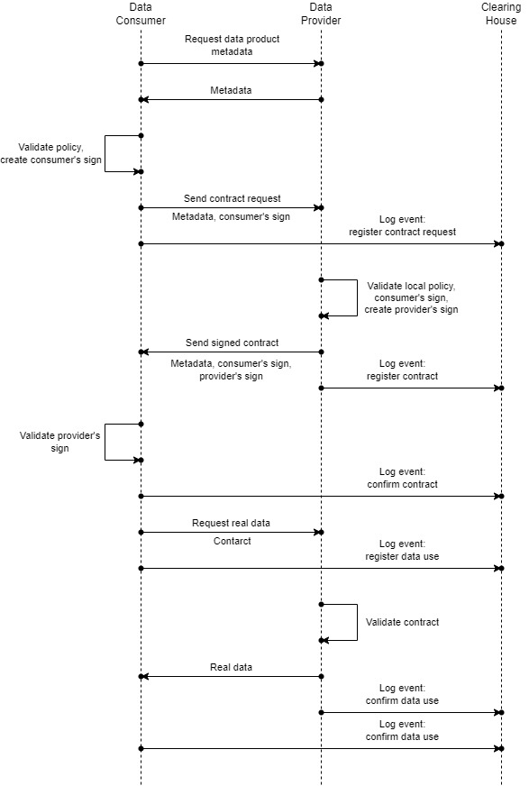

# Demo ORDL Contract

* **Use case 1: Sign contract and use data:**
  This use case demonstrates the process of checking data access policy, negotiation between consumer and provider, contract signing, data retrieval, and agreement registration in the registry.

  

* **Use case 2: Delegate permission and service access:**
  This use case demonstrates the process of delegating access to a third party, as well as access to a service by a third party.

## Requirements
Python 3.12+

## Installation
```bash
pip install pre-commit
pre-commit install
```

## Development
1. If you don't have `Poetry` installed run:
    ```bash
    pip install poetry
    ```

2. Install dependencies:
    ```bash
    poetry config virtualenvs.in-project true
    poetry install --no-root --with dev,test
    ```

3. Launch the usecase:
    ```bash
    poetry run python -m app.usecases <usecase_number>
    ```

    Usecase number:
    * 1 - Sign contract and use data
    * 2 - Delegate permission and service access

## License
MIT

## Collaboration guidelines
HIRO uses and requires from its partners [GitFlow with Forks](https://hirodevops.notion.site/GitFlow-with-Forks-3b737784e4fc40eaa007f04aed49bb2e?pvs=4)
